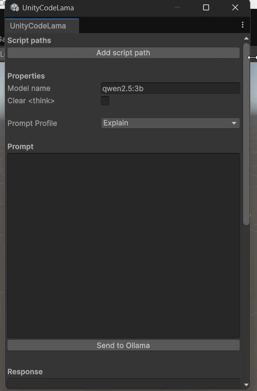
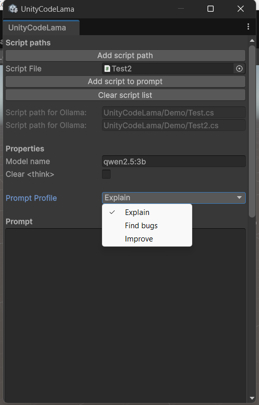

 # 🦙 UnityCodeLama — Unity Editor Tool

> 🔍 Analyze your Unity scripts using large language models directly from the Editor — powered by [Ollama](https://ollama.com).

---

## 🚀 Overview

**UnityCodeLama** is a powerful editor extension for Unity that allows you to send your C# scripts and prompts to an LLM (e.g. Qwen, Gemini, Deepseek, etc.) via Ollama — without ever leaving the editor.

It's useful for:
- 🔍 Code explanations
- 🐛 Bug hunting
- ✨ Suggestions & improvements

---

## 📦 Installation

1. Download the latest .unitypackage file from the Releases page.
2. Drag & drop it into your Unity project window.
3. Unity will automatically compile the editor extension.  

No additional setup required.

The `Plugins` folder includes several `.dll` files required for integration. 

---

## 💻 Usage

Open the tool from the Unity menu:  
`HardCodeDev → UnityCodeLama`

Once opened, you’ll see the following window:



---

## 🧰 Editor Window Features

### 📄 Scripts

| Setting               | Description |
|------------------------|-------------|
| **Add script path**    | Adds a new object field in the window to select a script. |
| **Script file**        | Drag & drop or select a `.cs` file to include. |
| **Add script to prompt** | Adds the selected script to the prompt queue. |
| **Clear script list**  | Removes all scripts from the queue. |

---

### ⚙️ Properties

| Setting            | Description |
|--------------------|-------------|
| **Model name**     | Name of the Ollama model to use (e.g. `qwen2.5:3b`). |
| **Clear <think>**  | Removes `<think>` blocks from models that produce internal thoughts (for cleaner output). |
| **Prompt profile** | Selects the type of analysis to perform (Explain, Find bugs, Improve). |



---

### 💬 Prompt

| Setting             | Description |
|---------------------|-------------|
| **Prompt**          | The custom message to send to the model (e.g. questions, requests). |
| **Send to Ollama**  | Sends your prompt, script(s), and profile to Ollama. |

See [How prompts are sent](#how-prompts-are-sent) for more details.

---

### 🤖 Response

| Setting             | Description |
|---------------------|-------------|
| **Response**        | The LLM-generated reply (read-only). |
| **Copy response**   | Copies the reply to your clipboard. |
| **Clear response**  | Clears the response field. |

---

> [!NOTE]
> This is an **Editor-only tool**. It works entirely within Unity Editor and doesn't affect runtime or builds.

---

## 📤 How Prompts Are Sent

Say you have a script like:

```csharp
using UnityEngine;

namespace HardCodeDev.Examples
{
    public class Test : MonoBehaviour
    {
        private int _count;
        private void Count() => _count++;
    }
}
```

You write a prompt like:

```
I made this script in 10 seconds!
```

With profile "Explain", the full message sent to the model will be:

```
Explain what this code does.
I made this script in 10 seconds! Here's the script(s): 

// Script starts 
using UnityEngine;

namespace HardCodeDev.Examples
{
    public class Test : MonoBehaviour
    {
        private int _count;
        private void Count() => _count++;
    }
}
// Script ends 
```

---

### ⚙️ Code Behind (Simplified)

```csharp
var promptInstruction = _promptOptions[_selectedPromptIndex] switch
{
    "Explain" => "Explain what this code does.",
    "Find bugs" => "Find any bugs or potential issues in this code.",
    "Improve" => "Suggest improvements to this code.",
    _ => ""
};

var fullPrompt = $"{promptInstruction}
{_prompt} Here's the script(s): {scriptInfo}";
```

The scripts are read using:

```csharp
scriptInfo += ScriptReader.ReadScript(path);
```

With `ScriptReader` defined as:

```csharp
public static class ScriptReader
{
    public static string ReadScript(string relativePath)
    {
        if (relativePath.StartsWith("/"))
            relativePath = relativePath.Substring(1);

        var fullPath = Path.Combine(Application.dataPath, relativePath);
        var code = "\n// Script starts \n";
        code += File.ReadAllText(fullPath);
        code += "\n// Script ends \n";
        return code;
    }
}
```
---

## 🛠 TODO

- [ ] Review which `.dll` files in the `Plugins` folder are actually required and remove the unnecessary ones.

---

## 📦 Distribution and Usage

This tool is provided as-is and is intended to help Unity developers integrate code analysis with large language models (LLMs) through Ollama.  
Feel free to modify and use it in your projects — but please keep attribution.

---

## 📄 License

This project is licensed under the **MIT License**.  
See the [LICENSE](LICENSE) file for full terms.

---

## 👨‍💻 Author

**HardCodeDev**  
- [GitHub](https://github.com/HardCodeDev777)  
- [Itch.io](https://hardcodedev.itch.io/)

---

> 💬 Got feedback, found a bug, or want to contribute? Open an issue or fork the repo on GitHub!
